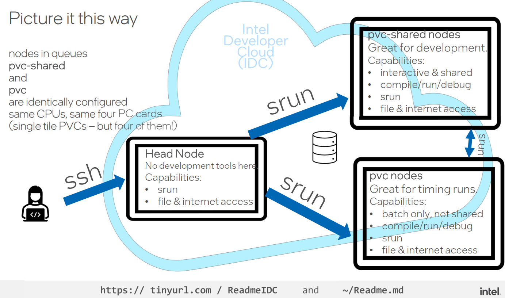
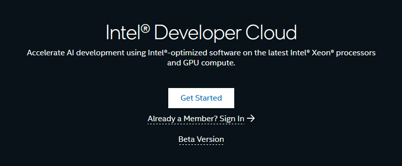
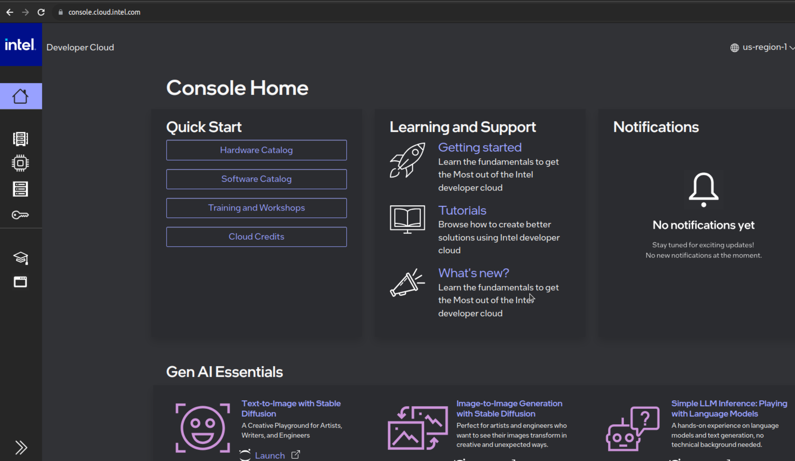
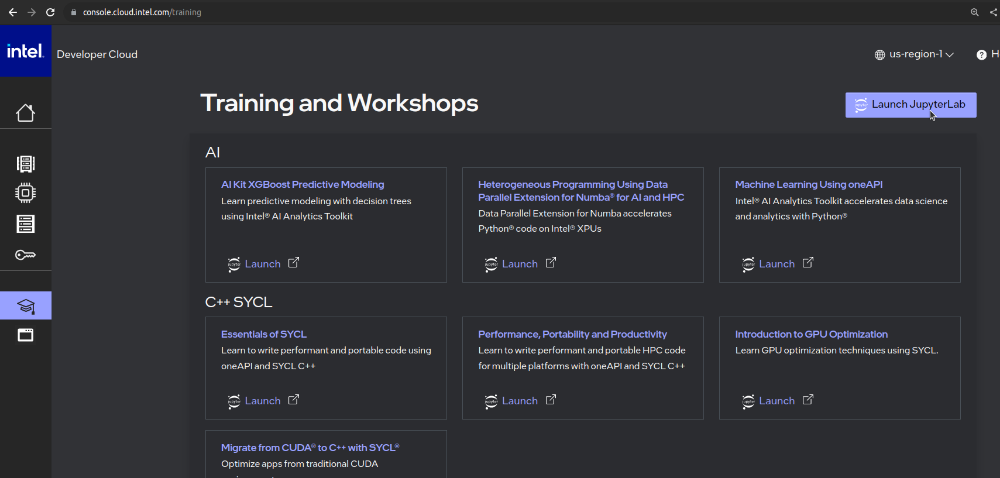
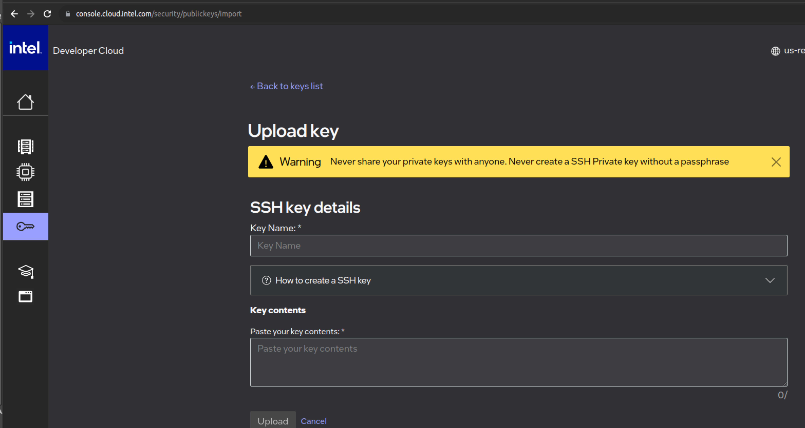
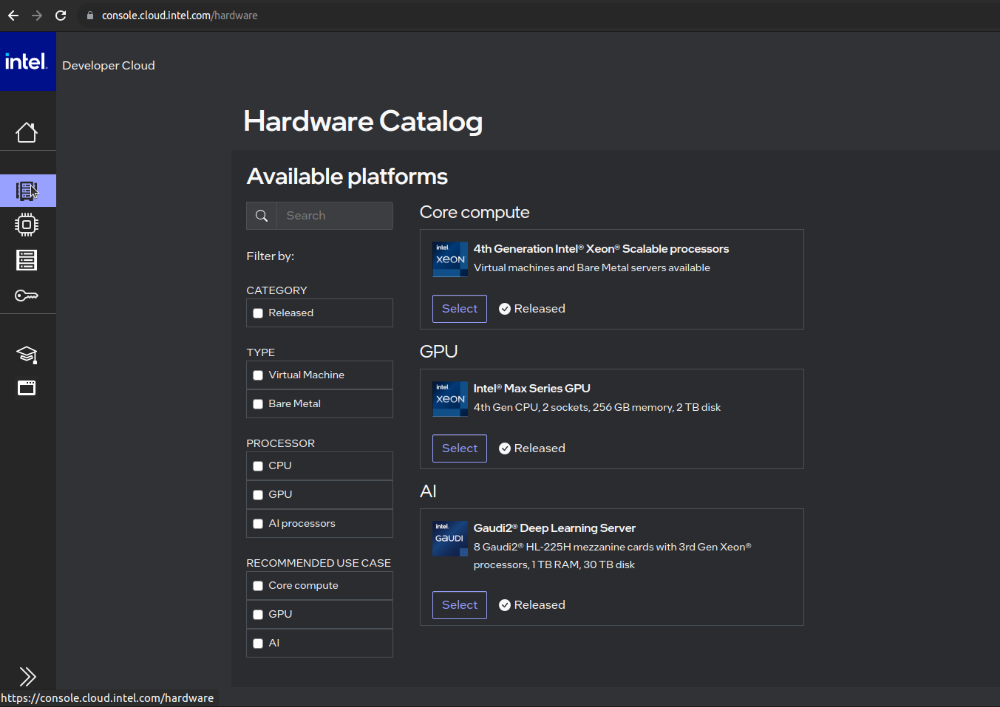
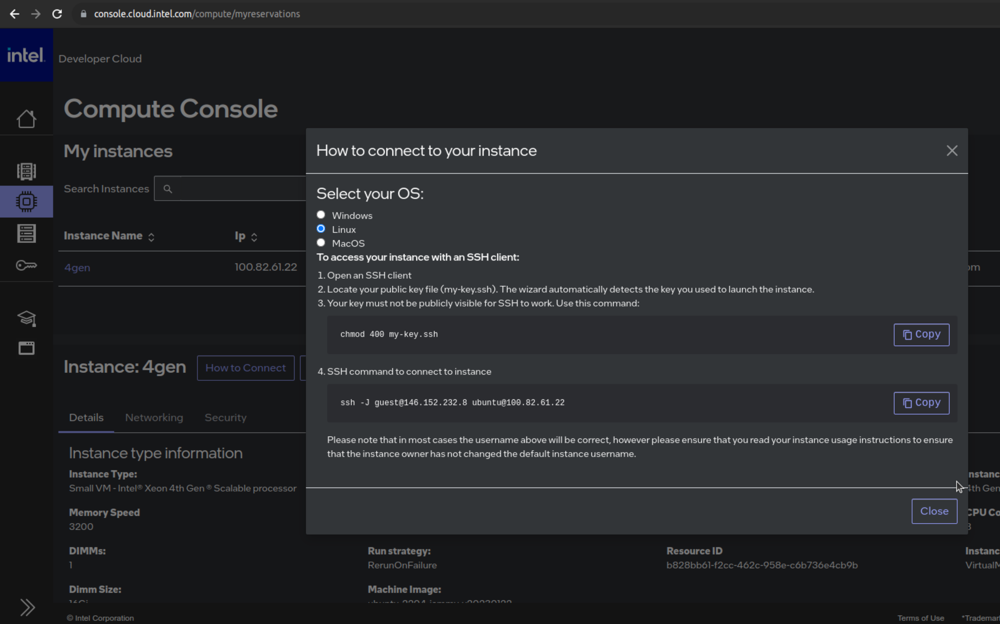

# Códigos del Taller
## Contenidos
* En este repositorio se encuentran los códigos propuestos en el taller [Taller de programación paralela en GPUs con oneAPI](https://casas.dev.fdi.ucm.es/etiquetas/x-hardware-track/) de la X Semana de la Informática
* Para poner a punto el taller se recomienda seguir los pasos de la sección [Setup del lab](#setup-del-lab)
* Los códigos que vamos a trabajar están disponibles en la [sección "Ejemplos"](#ejemplos), resumidamente trabajan algunos de los aspectos mostrados en la parte teórica:
    * helloWorld: ilustra la selección de dispositivos
    * Memoria USM: uso de USM
    * Suma de vectores: suma de vectores
    * Tratamiento de imágenes: transformación de imágen a 

# Setup del lab

## Transparencias
* Todo el material está disponible en el repositorio [github](https://github.com/garsanca/semanaInformatica2024)
    * Puede descargarse fácilmente clonando el repositorio ejecutando en un terminal el comando ```https://github.com/garsanca/semanaInformatica2024.git```
* Además las transparencias del taller están disponible en el [directorio "transparencias"](transparencias/transparencias_oneAPI.pdf) 

## Laboratorios FDI
* En los laboratorio está instalado el entorno de [oneAPI](https://www.oneapi.io/) para que pueda ser utilizado por los alumnos
* Únicamente hay que tener en cuenta 3 cuestiones:
     1. Está instalado en el sistema operativo **GNU-Linux**
     2. El entorno (compiladores, herramientas y librerías) se activan cargando el script **setvars.sh**: ```source /opt/intel/oneapi/setvars.sh```. Es importante hacerlo cada vez que se abra una consola o terminal

```bash
user@host:~/ $ source /opt/intel/oneapi/setvars.sh 
 
:: initializing oneAPI environment ...
   bash: BASH_VERSION = 5.1.16(1)-release
   args: Using "$@" for setvars.sh arguments: 
:: advisor -- latest
:: ccl -- latest
:: clck -- latest
:: compiler -- latest
:: dal -- latest
:: debugger -- latest
:: dev-utilities -- latest
:: dnnl -- latest
:: dpcpp-ct -- latest
:: dpl -- latest
:: inspector -- latest
:: intelpython -- latest
:: ipp -- latest
:: ippcp -- latest
:: ipp -- latest
:: itac -- latest
:: mkl -- latest
:: mpi -- latest
:: tbb -- latest
:: vpl -- latest
:: vtune -- latest
:: oneAPI environment initialized ::

user@host:~/ $ sycl-ls 
[opencl:0] ACC : Intel(R) FPGA Emulation Platform for OpenCL(TM) 1.2 [2021.13.11.0.23_160000]
[opencl:0] CPU : Intel(R) OpenCL 3.0 [2021.13.11.0.23_160000]
[opencl:0] GPU : Intel(R) OpenCL HD Graphics 3.0 [22.28.23726.1]
[level_zero:0] GPU : Intel(R) Level-Zero 1.3 [1.3.23726]
[host:0] HOST: SYCL host platform 1.2 [1.2]
```

## Cuenta en Intel Developer Cloud
* El [Intel® Developer Cloud](https://www.intel.com/content/www/us/en/developer/tools/devcloud/services.html) es un espacio de desarrollo **gratuito** para que la comunidad de desarrolladores puedan programar aplicaciones. 


### Hardware disponible
* Se puede testear y evaluar una variedad de máquinas virtuales
    * Sistemas *bare metal*
    * Dispositivos en el Edge
    * Plataformas para entrenamiento de IA
* Entornos para desarrollo
    * Contenedores
    * JupyterLabs
    * Conexión directa por SSH
    


### Instrucciones de acceso
* La documentación y actualizaciones disponible en [https://tinyurl.com/ReadmeIDC](https://tinyurl.com/ReadmeIDC) o en el [Readme.md](https://github.com/bjodom/idc)



### Registro
* Para disponer de cuenta en [Intel® Developer Cloud](https://www.intel.com/content/www/us/en/developer/tools/devcloud/services.html) se puede acceder seguir el enlace http://cloud.intel.com
* Siguiendo los pasos del proceso de registro:



1. Selección de **usuario Stardard**
2. Creación de cuenta


3. Introducción de datos personales


4. Verificación de correo mediante envío de email con un **código**

5. Aceptación de [términos y condiciones de uso](https://scheduler.cloud.intel.com/public/intel_developer_cloud_access_agreement.html) del Intel® Developer Cloud

### Acceso
* Para acceder a la cuenta en [Intel® Developer Cloud](https://www.intel.com/content/www/us/en/developer/tools/devcloud/services.html)
    * Clicar en **Already a Member? Sign In** e introducir las credenciales creadas anteriormente
* O bien se puede hacer con el "atajo" https://console.cloud.intel.com/




### Training
* JupyterLabs: en el menú **Training and Workshops**
    * Clicar en **LaunchJupyterLab**



* SSH: se puede conectar al IDC vía ssh previamente añadiendo las [*Account Keys*](https://console.cloud.intel.com/security/publickeys)



#### Configuración SSH
* Modificar el fichero *.ssh/config*

```bash
Host myidc #←YOU CAN CALL IT ANYTHING
Hostname idcbetabatch.eglb.intel.com
User uXXXXXX #← Request "scheduled access" at https://scheduler.cloud.intel.com/#/systems" to get your user identifier.
#ProxyCommand /usr/bin/nc -x YourProxy:XXXX %h %p # Uncomment if necessary
ServerAliveInterval 60
ServerAliveCountMax 10
StrictHostKeyChecking no # Frequent changes in the setup are taking place now, this will help reduce the known hosts errors.
UserKnownHostsFile=/dev/null
```

* En nodo *frontend* o *head* es un Ubuntu 22.04LTS
* Uso de nodo en modo interactivo: *srun --pty bash*
    * Nodo con Intel Data Center GPU Max 1100

``` bash 
user@localhost:~$ ssh myidc
uXXXX@idc-beta-batch-head-node:~$ srun --pty bash
uXXXX@idc-beta-batch-pvc-node-03:~$ source /opt/intel/oneapi/setvars.sh 
 
:: initializing oneAPI environment ...
   bash: BASH_VERSION = 5.1.16(1)-release
   args: Using "$@" for setvars.sh arguments: 

uXXXX@idc-beta-batch-pvc-node-03:~$ sycl-ls
Warning: ONEAPI_DEVICE_SELECTOR environment variable is set to opencl:cpu;opencl:fpga;level_zero:3.
To see the correct device id, please unset ONEAPI_DEVICE_SELECTOR.

[opencl:cpu:0] Intel(R) OpenCL, Intel(R) Xeon(R) Platinum 8480L 3.0 [2023.16.7.0.21_160000]
[opencl:acc:1] Intel(R) FPGA Emulation Platform for OpenCL(TM), Intel(R) FPGA Emulation Device 1.2 [2023.16.7.0.21_160000]
[opencl:cpu:2] Intel(R) OpenCL, Intel(R) Xeon(R) Platinum 8480L 3.0 [2023.16.7.0.21_160000]
[ext_oneapi_level_zero:gpu:0] Intel(R) Level-Zero, Intel(R) Data Center GPU Max 1100 1.3 [1.3.26516]
```

### Comandos Slurm 
* *sinfo*: obtener información de los nodos disponibles
* *squeue*: trabajos encolados
* *sbatch -p {PARTITION-NAME} {SCRIPT-NAME}*: encolar trabajo en las colas
* *scancel {JOB-ID}*: cancelar trabajo 
* *srun --pty bash*: lanzamiento de trabajo de forma interactiva

### Ejemplo lanzamiento job
1. Tomemos como ejemplo un código en SYCL que devuelve el **device** seleccionado en este caso una GPU
```c
#include <sycl/sycl.hpp>
using namespace sycl;
int main() {
//# Create a device queue with device selector
  queue q(gpu_selector_v);
//# Print the device name
  std::cout << "Device: " << q.get_device().get_info<info::device::name>() << "\n";
  return 0;
}
```

2. Podemos compilarlo con el compilador icpx
```bash
uXXXX@idc-beta-batch-pvc-node-03:~$ icpx -o ex exampleSYCL.cpp -fsycl
```

3. Lanzar job mediante slurm
```job
#!/bin/bash
#SBATCH --job-name=gpu_run
#SBATCH --partition=pvc-shared
#SBATCH --error=job.%J.err 
#SBATCH --output=job.%J.out
#SBATCH --mail-type=ALL
#SBATCH --mail-user=your@email.com

icpx -o ex exampleSYCL.cpp -fsycl
./ex
```

4. Lanzamos el job y visualizamos salida
```bash
uXXXX@idc-beta-batch-head-node:~$ sbatch job.sh
uXXXX@idc-beta-batch-head-node:~$ more job.42151.out 
Device: Intel(R) Data Center GPU Max 1100
```

### Lanzar Jupyterlab interactivo
1. Conexión por ssh al nodo *head-node*: *ssh myidc*
2. Lanzar sesión interactiva: *srun --pty bash*
3. Activar el entorno conda para poder lanzar Jupyter-Lab: *conda activate pytorch_xpu*
4. Lanzar Jupyterlab
    * Importante buscar la dirección de escucha del Jupyterlab, algo parecido a *http://10.10.10.X:8888/lab?token=9d83e1d8a0eb3ffed84fa3428aae01e592cab170a4119130*

```bash
user@localhost:~$ ssh myidc
uXXXX@idc-beta-batch-head-node:~$ srun --pty bash
uXXXX@idc-beta-batch-pvc-node-03:~$ source /opt/intel/oneapi/setvars.sh 
uXXXX@idc-beta-batch-pvc-node-03:~$ conda activate pytorch-gpu
(pytorch-gpu) uXXXX@idc-beta-batch-pvc-node-04:~$ jupyter-lab --ip $(hostname -i)
....
[I 2023-11-11 15:01:56.875 ServerApp] http://10.10.10.8:8888/lab?token=f25e4d3977b7b059d5ff4b376085562dbbaa3f9dffed4fde
....
```

5. Desde otro **terminal local** hacer un tunel ssh a la dirección que aparece en la consola lanzada: **10.10.10.X**

```bash
user@localhost:~$ ssh myidc -L 8888:10.10.10.8:8888
```

6. Conectarse con un navegador a la dirección local: **https://localhost:8888** e introducir el **token** que aparece en el ejemplo en este ejemplo *f25e4d3977b7b059d5ff4b376085562dbbaa3f9dffed4fde*

### Instancias en IDC
* Core compute
    * Basada en procesador Xeon 4th gen
       * VMs con 8, 16, 32 cores
       * Bare Metal 112 cores, 256GB y 2TB disco
* Intel Max GPU
    * 4xGPUs 1100 + 2xsockets Xeon 4th gen
* Gaudi Deep Learning Server
    * 8x Gaudi HL + Xeon Platinum 3gen
       



### Lanzar instancia
1. Lanzar instancia en la [consola->Hardware Catalog](https://console.cloud.intel.com/hardware)
2. Obtener la forma desde el apartado de [reservas](https://console.cloud.intel.com/compute/myreservations), por ejemplo mediante conexión ssh



# Ejemplos
## helloWorld
1. En este [ejemplo](helloWorld/main.cpp) vamos a ver como se selecciona un dispositivo
2. Como se elige el dispositivo: **sycl::device**
    * Lanzamiento de **kernel** a la *command-queue* asíncrona

* La siguiente tabla muestra la nomenclatura para seleccionar y asociar la cola a los dispositivos

|   |   |
|---|---|
|**type**                 | **Device**                                                   |
| default\_selector_v     | Selects any device or host device if no device can be found  |
| gpu\_selector_v         | Select a GPU                                                 |
| accelerator\_selector_v | Select an accelerator                                        |
| cpu\_selector_v         | Select a CPU device                                          |
|*my\_device\_selector*   | *Custom selector*                                            | 


* El siguiente [código](helloWorld/main.cpp) disponible en el directorio [helloWorld](helloWorld/) muestra un ejemplo de selección, donde
    * La línea ```d = sycl::device(sycl::gpu_selector_v)``` seleccione el dispositivo
    * La clase ```d.get_info``` devuelve informacion asociada al dispositivo
    * el ```single_task``` escribe en la salida la cadena "Hello, World!", que está asociada a la ejecución en el **dispositivo seleccionado**


```c
int main(int argc, char **argv) {

	auto d = sycl::device(sycl::default_selector_v);
	std::cout << "Using " << d.get_info<sycl::info::device::name>() << "\n";

	sycl::queue Q(d);

	Q.submit([&](handler &cgh) {
		// Create a output stream
		sycl::stream sout(1024, 256, cgh);
		// Submit a unique task, using a lambda
		cgh.single_task([=]() {
			sout << "Hello, World!" << sycl::endl;
		}); // End of the kernel function
	});   // End of the queue commands. The kernel is now submited

	// wait for all queue submissions to complete
	Q.wait();


  return 0;
}

```

* Para compilar los código existe un fichero [Makefile](helloWorld/Makefile) que invocando **make** en consola genera el ejecutable **exec**
   * Se puede elegir el dispositivo mediante la variable de entorno *ONEAPI_DEVICE_SELECTOR* con los dispositivos disponibles con el comando ```sycl-ls```

```bash
user@host:~/ $ make
icpx -c -o main.o main.cpp -I. -fsycl
icpx -o exec main.o -I. -fsycl  
user@host:~/ $ ls
exec  main.cpp  main.o  Makefile

user@host:~/ $ sycl-ls 
Warning: ONEAPI_DEVICE_SELECTOR environment variable is set to opencl:*;level_zero:1.
To see the correct device id, please unset ONEAPI_DEVICE_SELECTOR.
[opencl:acc:0] Intel(R) FPGA Emulation Platform for OpenCL(TM), Intel(R) FPGA Emulation Device 1.2 [2023.16.7.0.21_160000]
[opencl:cpu:1] Intel(R) OpenCL, Intel(R) Xeon(R) Platinum 8480+ 3.0 [2023.16.7.0.21_160000]
[opencl:gpu:2] Intel(R) OpenCL Graphics, Intel(R) Data Center GPU Max 1100 3.0 [23.22.26516.29]
[opencl:gpu:3] Intel(R) OpenCL Graphics, Intel(R) Data Center GPU Max 1100 3.0 [23.22.26516.29]
[opencl:gpu:4] Intel(R) OpenCL Graphics, Intel(R) Data Center GPU Max 1100 3.0 [23.22.26516.29]
[opencl:gpu:5] Intel(R) OpenCL Graphics, Intel(R) Data Center GPU Max 1100 3.0 [23.22.26516.29]
[ext_oneapi_level_zero:gpu:0] Intel(R) Level-Zero, Intel(R) Data Center GPU Max 1100 1.3 [1.3.26516]

user@host:~/ $ ONEAPI_DEVICE_SELECTOR=opencl:1 ./exec
Using Intel(R) Xeon(R) Platinum 8480+
Hello, World!
user@host:~/ $ ONEAPI_DEVICE_SELECTOR=opencl:2 ./exec
Using Intel(R) Data Center GPU Max 1100
Hello, World!
```

### ToDo
* Se recomienda experimentar con el cambio de **selector** para seleccionar CPU/GPU...


## Suma de vectores
* El siguiente [ejemplo](vector_add/vector_add.cpp) ilustra el código de suma de vectores $C_{i} = A_{i}+B_{i}$
    * El alumno deberá de completar el código que aparece con el texto **TODO** 


```c
int *a; //TODO: create vectors with USM
int *b; //TODO: create vectors with USM
int *c; //TODO: create vectors with USM

// Parallel for
for(int i=0; i<N; i++){
	a[i] = i;   // Init a
	b[i] = i*i; // Init b
}


// Create a kernel to perform c=a+b
Q.submit([&](handler &h) { 
	/* To Do!!! */
}

for(int i=0; i<N; i++)
	std::cout << "c[" << i << "] = " << c[i] << std::endl;

free(a, Q);
free(b, Q);
free(c, Q);
```

### ToDo
1. Rellenar la reserva de memoria de *a*, *b* y *c* empleando el esquema de USM
2. Además se debe de codificar el kernel de suma de vectores dentro del **Q.submit**

## Procesamiento de imágenes: RGB a sepia
La transformación de una imagen del espacio de color RGB a sepia implica ajustar los componentes de color de la imagen para darle un aspecto cálido y envejecido. El proceso generalmente se realiza mediante una combinación de ajustes en los valores de los canales de color rojo, verde y azul. Aquí hay un enfoque básico para lograr esta transformación:
$R_{\text{sepia}} = (R \cdot 0.393) + (G \cdot 0.769) + (B \cdot 0.189)$
$G_{\text{sepia}} = (R \cdot 0.349) + (G \cdot 0.686) + (B \cdot 0.168)$
$B_{\text{sepia}} = (R \cdot 0.272) + (G \cdot 0.534) + (B \cdot 0.131)$

El fichero fuente [sepia.cpp](sepia/sepia.cpp) contiene la codificación de la transformación de una imagen procedente de vídeo a sepia.
Para compilar el proyecto se ha de (1) crear una carpeta "build", (2) acceder a dicha carpeta, (3) invocar la herramienta *cmake* y (4) compilar con make. Los pasos se detallan a continuación:

```bash 
user@host:~/sepia$ mkdir build
user@host:~/sepia$ cd build/
user@host:~/sepia/build$ cmake ..
-- The CXX compiler identification is GNU 11.4.0
-- Detecting CXX compiler ABI info
-- Detecting CXX compiler ABI info - done
-- Check for working CXX compiler: /usr/bin/c++ - skipped
-- Detecting CXX compile features
-- Detecting CXX compile features - done
-- Found OpenCV: /usr (found version "4.5.4") 
-- Configuring done
-- Generating done
-- Build files have been written to: sepia/build
user@host:~/sepia$ make
[ 50%] Building CXX object CMakeFiles/sepia.dir/sepia.cpp.o
[100%] Linking CXX executable sepia
[100%] Built target sepia
user@host:~/sepia/build$ ./sepia 
Usage: ./sepia <video_filename|0 for webcam>
user@host:~/sepia/build$ ./sepia 0
```
El proyecto utiliza [OpenCV](https://opencv.org/) para facilitar el manejo de vídeo e imágenes. El ejecutable muestra en una ventana vídeo original (o el procedente de la webcam si se invoca con el argumento **0**) y la imágen procesada en tiempo real generando su equivalente en "filtrado sepia". El ejecutable tiene varias opciones que se controlan con el teclado:
- **s**: *save*/o guardado de una imagen en el archivo
- **d**: ejecución en el **dispositivo**
- **h**: ejecución en el **host**
- **q**: *quit*/cerrar de la aplicación

El filtrado sepia se procesa en las rutinas *applySepia* y *applySepiaKernel* que se detallan a continuación:

```c
// Function to apply sepia effect using a kernel
void applySepiaKernel(unsigned char* input, unsigned char* output, size_t sizeX, size_t sizeY) {
	// Sepia transformation matrix
	float sepia[3][3] = {
		{0.393f, 0.769f, 0.189f},
		{0.349f, 0.686f, 0.168f},
		{0.272f, 0.534f, 0.131f}
	};

	for (int y = 0; y < sizeY; ++y) {
		for (int x = 0; x < sizeX; ++x) {
			float r_in = input[(y * sizeX + x) * 3 + 2]; // Red channel
			float g_in = input[(y * sizeX + x) * 3 + 1]; // Green channel
			float b_in = input[(y * sizeX + x) * 3 + 0]; // Blue channel

			float r_out = sepia[0][0]*r_in + sepia[0][1]*g_in + sepia[0][2]*b_in;
			float g_out = sepia[1][0]*r_in + sepia[1][1]*g_in + sepia[1][2]*b_in;
			float b_out = sepia[2][0]*r_in + sepia[2][1]*g_in + sepia[2][2]*b_in;

			// Clamp the values to be within the range [0, 255]
			r_out = std::min(std::max(r_out, 0.0f), 255.0f);
			g_out = std::min(std::max(g_out, 0.0f), 255.0f);
			b_out = std::min(std::max(b_out, 0.0f), 255.0f);

			// Set the output pixel
			output[(y * sizeX + x) * 3 + 0] = b_out;
			output[(y * sizeX + x) * 3 + 1] = g_out;
			output[(y * sizeX + x) * 3 + 2] = r_out;
		}
	}
}

// Function to apply sepia effect to an image
void applySepia(Mat& input, Mat& output) {
	output = Mat::zeros(input.size(), input.type());

	// Prepare input and output pointers
	size_t sizeX = input.cols;
	size_t sizeY = input.rows;
	unsigned char* inputPtr  = reinterpret_cast<unsigned char*>(input.data);
	unsigned char* outputPtr = reinterpret_cast<unsigned char*>(output.data);

	// Apply sepia effect using applySepiaKernel
	applySepiaKernel(inputPtr, outputPtr, sizeX, sizeY);
}
```

El alumno deberá rellenar las funciones **applySepiaSYCL** y **applySepiaKernelSYCL**, donde se ha guiado el desarrollo a realizar con los comentarios "To fill". Además se debe de proceder a la reserva de memoria USM en el **main**.


